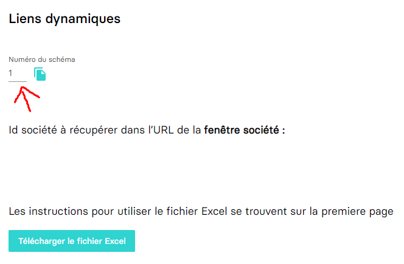

# 🔹 Authentification avec accès cabinet

Notre service authentification possède un endpoint spécifique qui permet la génération d'un API Token spécialement conçu pour une utilisation avec accès cabinet. La durée de vie du token est de dix minutes.

## Génération de la clé (API Token)

La route (racine) pour la requête http est POST **/api/authenticate/firm**.

Le body (JSON) de la requête pour l’authentification:
```json
{
    "mail": "{{mail}}",
    "password": "{{password}}"
}
```

Les champs “**password**” et “**mail**” doivent être complétés avec le compte qui vous a été fourni. À noter qu'un champ supplémentaire "**firm**" peut être renseigné (si votre compte permet l'accès à plusieurs cabinets/entités MyUnisoft).

> 👀 Le champ **firm** peut contenir l'ID numérique de l'entité/schéma ou bien le nom de celui-ci (sur MyUnisoft). Nous appelons "entité" un cabinet ou un groupement de cabinets.

---

Vous devriez recevoir un status code `200` avec un JSON contenant la clé API Token.
```json
{
    "api_token": "{{API_TOKEN}}",
    "expiresIn": "2021-04-12 11:54:46",
    "firm": {
        "id": 80,
        "label": "TESTS PARTENAIRES"
    }
}
```

## Bonus: récupérer l'id de l'entité/schéma MyUnisoft

Dans l'interface MyUnisoft il est possible de récupérer l'id de l'entité par le biais du menu `Tenue` > `Liens dynamiques`. Il suffira de récupérer le "numéro du schéma".



Si vous n'avez pas vous-même accès un collaborateur de l'entité pourra toujours vous fournir l'information (N'hésitez pas non plus à demander à notre équipe).
